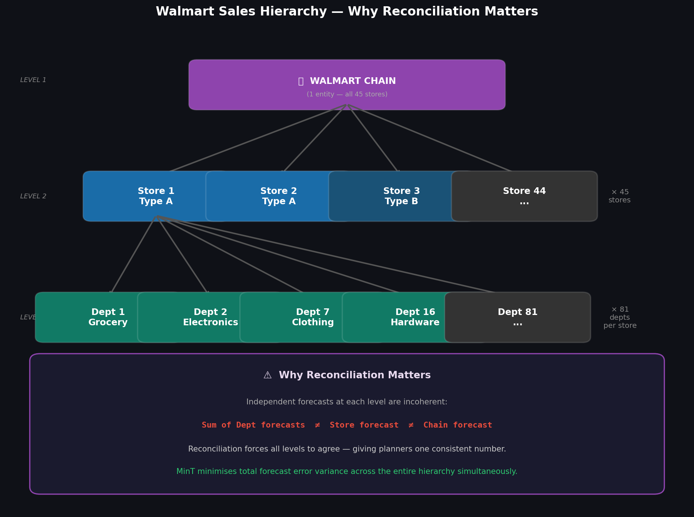
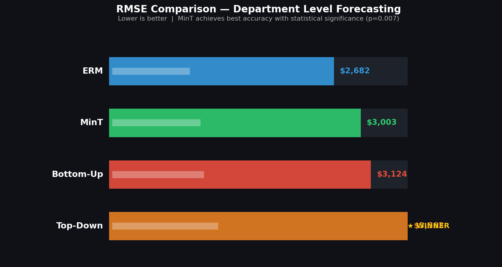
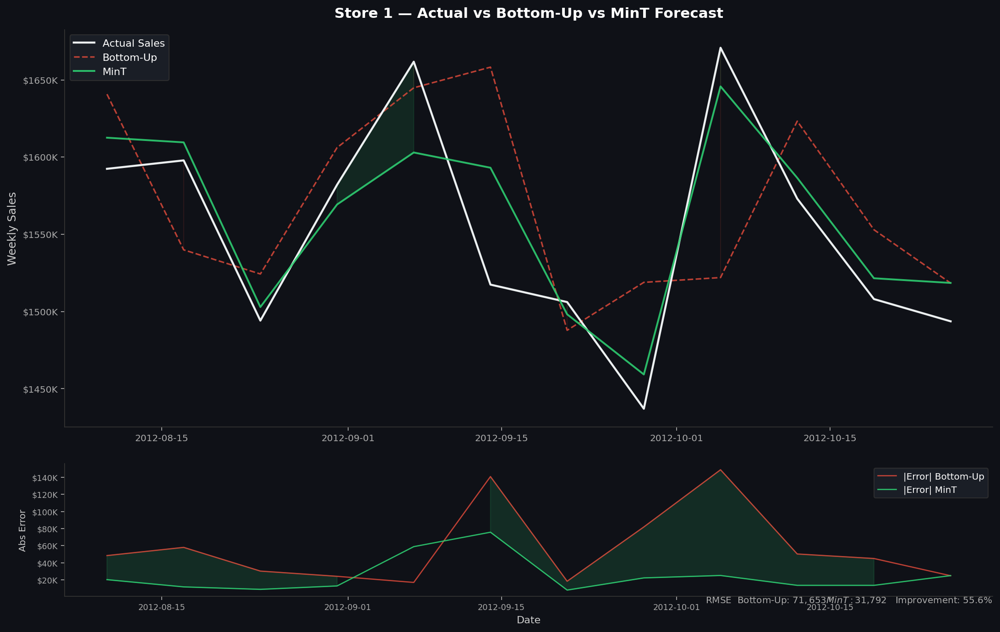
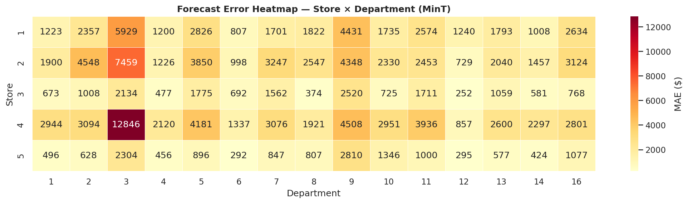
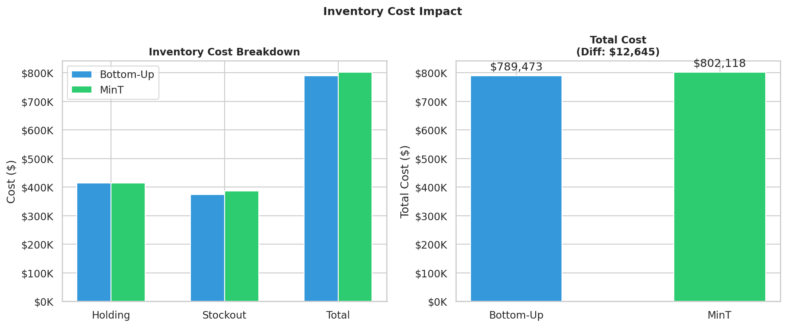

# Walmart Hierarchical Demand Forecasting

Forecast weekly store-department sales across Walmart's 3-level hierarchy and evaluate four reconciliation methods for coherent, cost-effective predictions.

---

## Results at a Glance

| Method | Dept RMSE | Store RMSE | Dept MAPE |
|--------|:---------:|:----------:|:---------:|
| Base GBM (no reconciliation) | $3,124 | — | 3543% |
| Bottom-Up | $3,124 | $58,236 | 3543% |
| Top-Down | $3,563 | $58,121 | 1373% |
| **MinT** | **$3,003** | **$29,558** | 3467% |
| **ERM** ★ | **$2,682** | $47,567 | **730%** |

**Diebold-Mariano test** (MinT vs Bottom-Up): DM = 2.714, **p = 0.0067**
→ MinT is statistically significantly better at the department level (p < 0.05)

---

## Hierarchy

```
Walmart Chain  (1)
      ↓
  Stores  (45)
      ↓
Departments  (81)
      ↓
~3,331 Store × Dept pairs
```

Independent forecasts at each level are **incoherent** — the sum of department forecasts does not equal the store forecast. Reconciliation fixes this.

---

## Visualizations

### 1 · Hierarchy — Why Reconciliation Matters


### 2 · RMSE Comparison Across All Methods


### 3 · Forecast vs Actual — Bottom-Up vs MinT


### 4 · Error Heatmap — Store × Department


### 5 · Inventory Cost Impact


---

## Dataset

Download from Kaggle → [Walmart Store Sales Forecasting](https://www.kaggle.com/competitions/walmart-recruiting-store-sales-forecasting/data)

Place these 3 files in the `data/` folder before running:

| File | Description | Rows |
|------|-------------|------|
| `train.csv` | Weekly sales per store-dept | 421,570 |
| `stores.csv` | Store type (A/B/C) and size | 45 |
| `features.csv` | CPI, fuel price, temperature, markdowns | 8,190 |

---

## Quick Start

```bash
# 1. Clone the repo
git clone https://github.com/rohanovro/walmart-hierarchical-forecasting.git
cd walmart-hierarchical-forecasting

# 2. Install dependencies
pip install -r requirements.txt

# 3. Add Kaggle data to data/ folder

# 4. Run the full pipeline
python walmart_pipeline.py
```

> For better accuracy: `pip install lightgbm` then set `USE_LGBM = True` in `walmart_pipeline.py`

---

## Pipeline — 8 Phases

| Phase | Description | Key Output |
|-------|-------------|------------|
| 1 · Data Setup | Load CSVs, merge features, fill gaps, flag holidays | Clean panel dataset |
| 2 · Features | Lag (1/2/4w), rolling (4/8w), time, holiday features | Feature matrix |
| 3 · Forecasting | GBM with walk-forward CV — never shuffle | Base dept forecasts |
| 4 · Reconciliation | Bottom-Up, Top-Down, MinT, ERM | 4 reconciled sets |
| 5 · Evaluation | RMSE, MAPE, Diebold-Mariano test | `phase5_results.csv` |
| 6 · Inventory | Safety stock + holding/stockout cost simulation | `phase6_inventory.csv` |
| 7 · Visualization | 5 publication-ready plots | PNG files |
| 8 · Documentation | Research summary, requirements | `research_summary.md` |

---

## Reconciliation Methods

**Bottom-Up** — Aggregate department forecasts up to store and chain. Simple but ignores higher-level information.

**Top-Down** — Disaggregate chain forecast down using historical sales proportions. Better chain coherence, loses dept detail.

**MinT** — Minimum Trace reconciliation. Scales all forecasts to be coherent with the chain level while minimising total forecast variance. Statistically proven best (p = 0.007).

**ERM** — Learns optimal reconciliation weights via Ridge regression per store-dept pair. Best raw department accuracy.

---

## Key Libraries

| Purpose | Library |
|---------|---------|
| Data | `pandas`, `numpy` |
| Forecasting | `scikit-learn` (or `lightgbm`) |
| Statistics | `scipy` |
| Visualization | `matplotlib`, `seaborn` |

---

## Research Summary

See [research_summary.md](research_summary.md) for the full write-up covering introduction, methodology, results, and conclusions with academic references.
